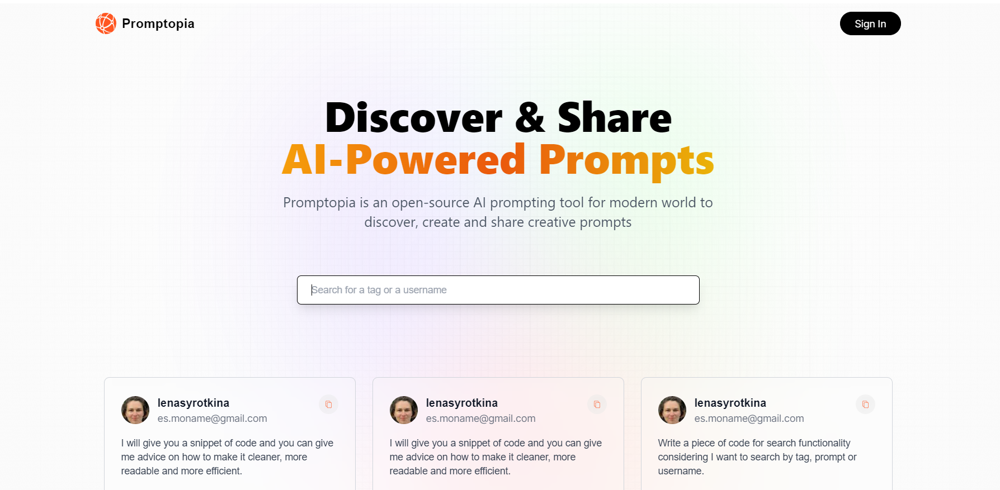

This is a [Next.js](https://nextjs.org/) project bootstrapped with [`create-next-app`](https://github.com/vercel/next.js/tree/canary/packages/create-next-app).

## Overview

Promptopia is an open-source AI prompting tool for modern world to discover, create and share creative prompts

 

## Features implemented
- User Authentication: Google Sign-In using NextAuth.js and Session management to keep users logged in
- User Profiles: displaying user profiles with profile pictures
- Create and Manage Prompts: users can create new prompts with associated tags, edit and delete prompts created by the user
- Prompt Feed: display a feed of all prompts created by users
- Search and Filter feeds: search functionality to find prompts by tags, usernames, or content and filter by clicking on tags
- Design using Tailwind CSS

## Getting Started

First, run the development server:

```bash
npm run dev
# or
yarn dev
# or
pnpm dev
# or
bun dev
```

Open [http://localhost:3000](http://localhost:3000) with your browser to see the result.

You can start editing the page by modifying `app/page.js`. The page auto-updates as you edit the file.

This project uses [`next/font`](https://nextjs.org/docs/basic-features/font-optimization) to automatically optimize and load Inter, a custom Google Font.
